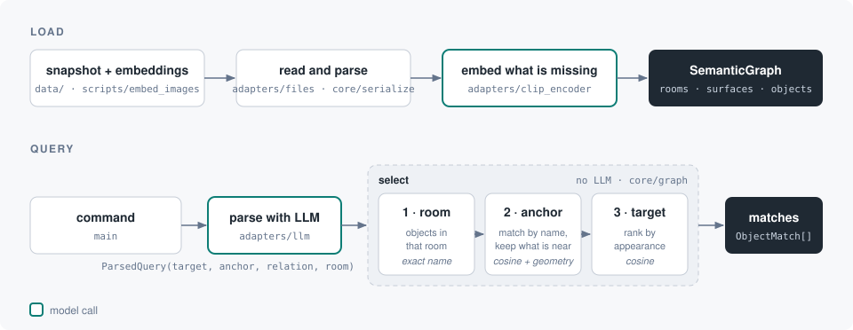

# Semantic Map

A persistent semantic graph of a known indoor environment: rooms, the surfaces
inside them, and the objects seen on those surfaces over time.

It answers what an occupancy grid cannot:

- *Where is the cup?* — retrieval over object embeddings, without moving.
- *What room and surface is this 3D point on?*
- *What is out of place?* — object category vs. the surface it was found on.
- *What have I not looked at recently?*

The map layout is known in advance, so there is no exploration or room
segmentation here. The contribution is the object layer on a fixed skeleton.

Standalone library, developed offline against a loaded snapshot, meant to be
wrapped as a ROS 2 node later without touching the core.

## Architecture

```
  core/  ──►  ports.py  ◄──  adapters/
  logic       protocols      implementations
```

**`core/`** — pure logic. Imports `numpy` and the protocols, nothing else. Never
ROS, torch, a database or a file.

- `types.py` — the vocabulary: `Point`, `Pose`, `Surface`, `Room`,
  `Observation`, `ObjectInstance`, `Snapshot`.
- `config.py` — thresholds, plus the name→type and category→placement tables.
- `graph.py` — `SemanticGraph`, the whole logic.

Three layers. **Rooms** (polygons) and **surfaces** (furniture poses) are read
once from the map and never change. **Objects** are the only layer built online.

**`ports.py`** — `ClipEncoder`, `LLM`, `Clock`. Declarations only.

**`adapters/`** — local CLIP, Ollama, clocks and file loading. `ros.py` holds the
same ports answered by ROS services, for the robot; `core/` and `ports.py` are
reused unchanged.

**`data/`** — `mock_snapshot.json`: a real competition layout with synthetic
objects and timestamps. `images/` holds one photo per object, from Wikimedia
Commons (`images/SOURCES.md`); `scripts/embed_images.py` turns them into the
object embeddings. Without them, objects fall back to the text of their label.

## Flow



Steps 2 and 3 only run when the command has an anchor or a target. With no
target, everything left is returned unranked.

The target score mixes two cosines: the query against the object's image
embedding and against its name. `name_weight` sets the mix (0 is appearance
only, 1 is name only), and only the image similarity decides whether an object
matches at all.

## Run locally

```bash
python3 -m venv .venv && .venv/bin/pip install -r requirements.txt
docker run -d --runtime nvidia --network host -v ollama:/root/.ollama --name semantic-map-ollama ollama/ollama
docker exec semantic-map-ollama ollama pull qwen3:8b

.venv/bin/python scripts/embed_images.py   # data/images -> data/embeddings.npz (not committed)
.venv/bin/python -m pytest
.venv/bin/python main.py "what is next to the bed" "tráeme la bebida de la cocina"
```

Tests that need CLIP or Ollama skip themselves when either is missing.

## Why

**Ports and adapters** — the logic runs in a notebook today and on a Jetson
later. Injecting CLIP, the LLM and the clock keeps the core testable with no GPU,
no ROS and no network, so moving to the robot adds adapters instead of rewriting
logic.

**A `Clock` port, not `time.time()`** — staleness is the main thing worth
testing, and a hidden wall clock makes it untestable. A loaded snapshot carries
its own capture time, so "now" is not always wall time.

**Own dataclasses, not ROS messages or dicts** — adapters translate at the
boundary. Dicts work until the first argument over `sublocation` vs. `subarea`.

**The snapshot is the central contract** — what the robot dumps, what offline
work loads, what a test replays. One format means the two paths cannot drift, and
runs stay reproducible.

**Parse and select are separate** — `parse` is the slow LLM call, `select` is
fast and pure. Splitting them keeps a model off the critical path.

**Degrade instead of failing** — no encoder falls back to label matching, no LLM
treats the whole command as the target. On a competition clock a slow model must
not stop the robot.

**Not thread-safe, on purpose** — locks stay out of the core. On the robot a
single mutually-exclusive callback group serializes access.
